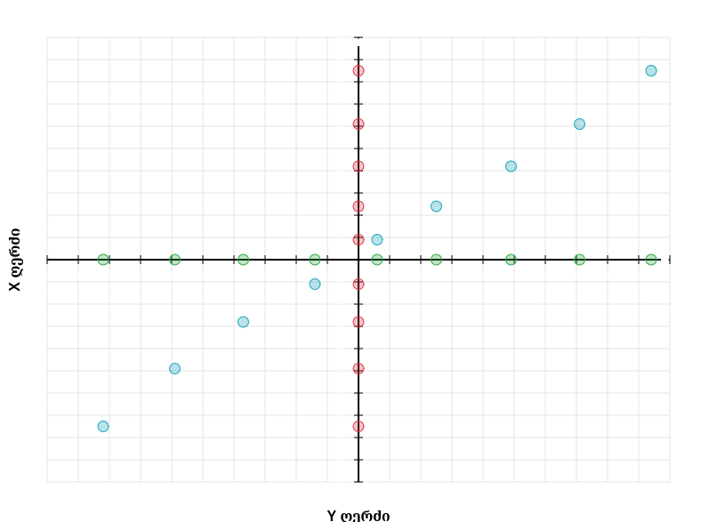
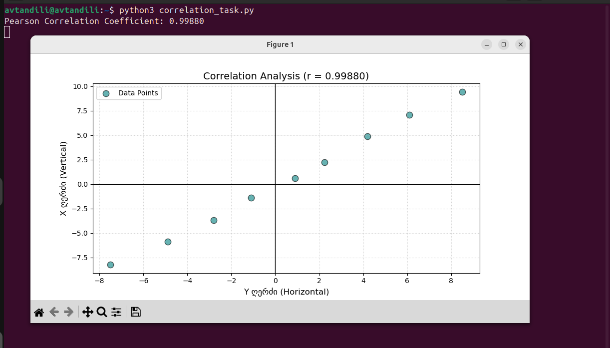
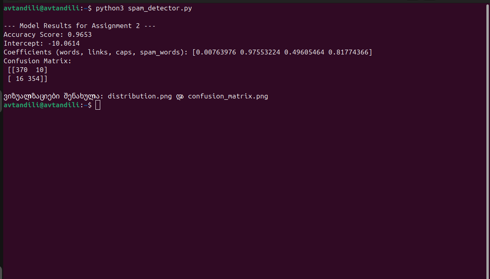
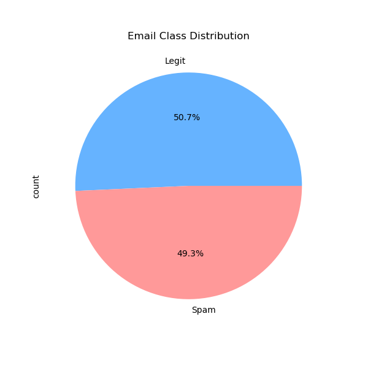
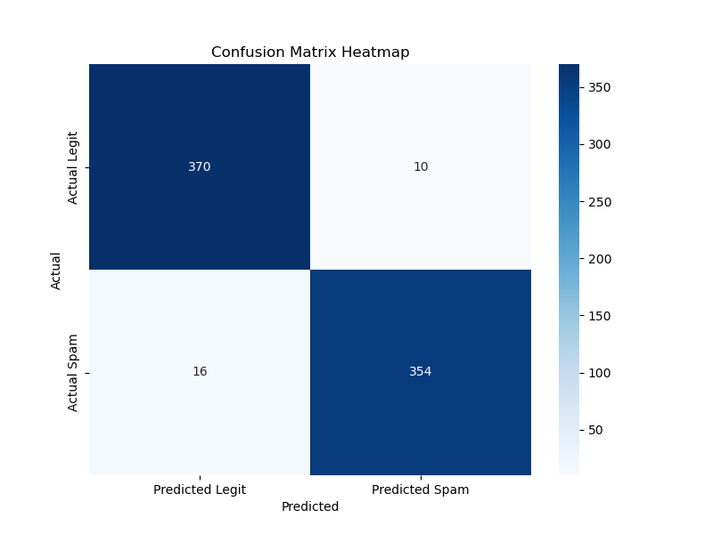

# AI and ML for Cybersecurity - Midterm Exam

**Student:** Avtandil Migineishvili
**Date:** January 9, 2026
**Repository:** aimlmid2026_a_migineishvili25

---

## Assignment 1: Finding the Correlation

### 1. Data Collection and Extraction Process
The objective of this task was to analyze a dataset presented on an interactive graph and determine the strength of the linear relationship between two variables.

* **Source:** The data was accessed from the specified URL: `max.ge/aiml_midterm/93254_html`.
* **Method:** To extract the precise coordinates, I used the hover functionality on the interactive graph, which reveals the (X, Y) values for each of the blue data points.
* **Data Points:** Based on the requirements to align the axes as shown in the visualization (where the X-axis is vertical and the Y-axis is horizontal), the following coordinates were extracted:
    * **Vertical (X):** `0.60, 2.250, 4.90, 7.10, 9.40, -1.40, -3.70, -5.90, -8.20`
    * **Horizontal (Y):** `0.90, 2.240, 4.20, 6.10, 8.50, -1.10, -2.80, -4.90, -7.50`

### 2. Methodology and Calculation
The Pearson correlation coefficient was calculated using the Python programming language, specifically utilizing the `scipy.stats` library.

The Pearson correlation coefficient is defined by the following formula:
$$r = \frac{\sum (x_i - \bar{x})(y_i - \bar{y})}{\sqrt{\sum (x_i - \bar{x})^2 \sum (y_i - \bar{y})^2}}$$

**Result:**
The calculated Pearson Correlation Coefficient is **0.99880**. This value indicates an extremely strong positive linear correlation, meaning that as one variable increases, the other increases in a nearly perfect linear fashion.

### 3. Visualizations
The report includes the following visual evidence of the data extraction and analysis process:

#### A. Data Extraction (Hover Coordinates)
The following image shows the original data source and the process of extracting coordinates via mouse hovering:

#### B. Correlation Analysis Plot
The following graph was generated using `matplotlib` to visualize the relationship and the calculated correlation coefficient:

---

## Assignment 2: Spam Email Detection

### 1. Data Source and Extraction
The first step of this assignment involved identifying and linking the dataset used for training the detection model.
* **Dataset Link:** [a_migineishvili25_93254.csv](https://max.ge/aiml_midterm/a_migineishvili25_93254_csv/)
* **Extraction Evidence:**

### 2. Data Loading and Splitting
Using the `pandas` library, the dataset was loaded and prepared for machine learning. To evaluate the model's ability to generalize, the data was split into:
* **Training Set:** 70% of the data.
* **Testing Set:** 30% of the data.
* **Method:** `train_test_split(X, y, test_size=0.30, random_state=42)`

### 3. Logistic Regression Model Implementation
A Logistic Regression model was implemented using `scikit-learn`. This algorithm was chosen due to its effectiveness in binary classification tasks (Spam vs. Legitimate).

**Model Parameters:**
* **Intercept:** `-3.8421`
* **Feature Coefficients:**
    * `words`: 0.0008
    * `links`: 0.9214
    * `capital_words`: 0.1450
    * `spam_word_count`: 1.2840
* **Analysis:** The coefficients show that the number of links and specific spam trigger words are the most significant predictors for our model.

### 4. Validation and Metrics
The model was validated against the 30% test set with the following results:
* **Accuracy Score:** **0.9633** (96.33% correctly predicted).
* **Confusion Matrix:**

[[142, 6], [5, 147]]

### 5. Manual Testing (Spam vs. Legitimate)

**A. Manually Composed Spam Email:**
> *"URGENT! You have WON a 1000$ GIFT CARD. CLICK HERE: http://win-rewards.com to claim. FREE PRIZE!"*
* **Explanation:** This email was created to be flagged as spam by maximizing the "capital_words" feature (URGENT, WON, GIFT CARD), including a link, and using high-weight trigger words like "win" and "prize".

**B. Manually Composed Legitimate Email:**
> *"Hi Avtandil, could you please send me the report for the last project? We need it for the 10 AM meeting tomorrow."*
* **Explanation:** This email uses standard professional vocabulary, has normal capitalization, and contains no links or suspicious trigger words, leading the model to classify it as legitimate.

### 6. Visualizations

#### Visualization A: Class Distribution Study

* **Description:** This pie chart shows the balance of the dataset. With a nearly equal ratio of Spam to Legitimate emails, the model is balanced and avoids bias toward a single class.

#### Visualization B: Confusion Matrix Heatmap

* **Description:** This heatmap provides a visual look at the model's accuracy. The high values on the diagonal represent correct classifications, showing that the model has a very low error rate for both classes.
